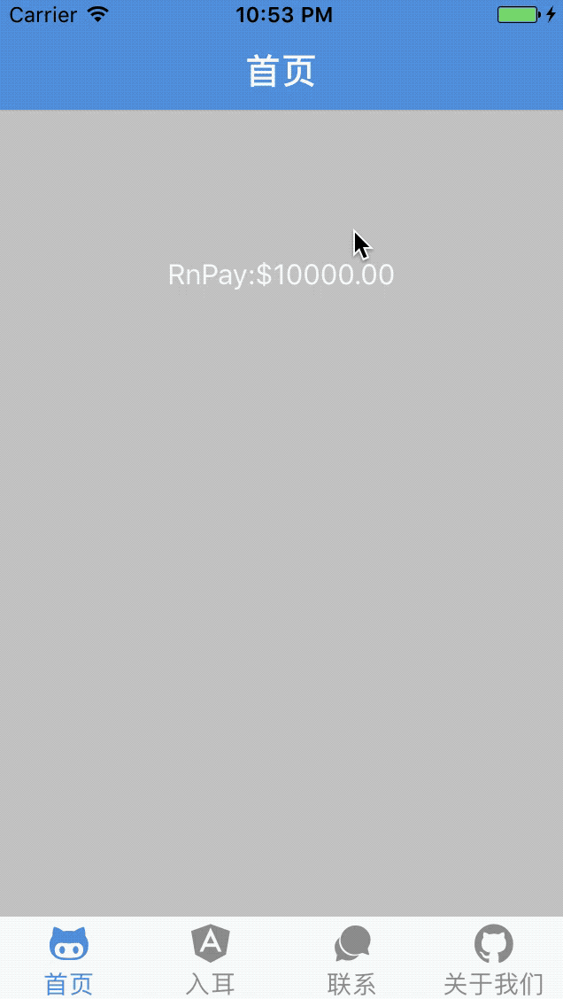

# React Native Pay 
[](https://www.zhihu.com/people/wang-meng-30-78/posts)
[](https://github.com/lamphc/react-native-pay "View this project on github") 
[](https://www.npmjs.com/package/react-native-modal-pay) 
[](https://npmjs.org/package/react-native-modal-pay)
[](https://npmjs.org/package/react-native-modal-pay)
[](https://npmjs.org/package/react-native-modal-pay "View this project on npm")
[](https://npmjs.org/package/react-native-modal-pay "View this project on npm")
[](https://github.com/lamphc/react-native-pay/blob/master/LICENSE)


### Installation

#### Using npm:

```sh
$ npm i react-native-modal-pay -S
```

#### Using yarn:

```sh
$ yarn add react-native-modal-pay
```

### Usage

```jsx
/**
|--------------------------------------------------
| react-native-pay demo
|--------------------------------------------------
*/
import React from 'react';
import { View, Text, StyleSheet } from 'react-native';

import { PayMny } from 'react-native-modal-pay';


class RnPay extends React.Component {
    constructor(props) {
        super(props)

    }

    _pay() {
        this.payMny._invokePay(true)
    }

    _onPay(va) {
        let cl = setTimeout(() => {
            if (va) {
                clearTimeout(cl)
                this.payMny._onErrorHandler('Password error!')
            }
        }, 2000);
    }

    render() {
        return (
            <View style={styles.container}>
                <Text onPress={() => this._pay()} style={styles.txt}>RnPay:$10000.00</Text>

                <PayMny
                    show={true}
                    ref={(payMny) => this.payMny = payMny}

                    onChange={(va) => this._onPay(va)}

                />
            </View>
        );
    }
}

// define your styles
const styles = StyleSheet.create({
    container: {
        flex: 1,
        paddingTop: '26%',
        // justifyContent: 'center',
        alignItems: 'center',
        backgroundColor: '#ccc',
    },
    txt: {
        color: '#fff',
        fontSize: 16
    }
});

export default RnPay;

```


#### Props

| Prop | Type | Description |
|---|---|---|
|**`show`**|`bool`|Show the pay.|
|**`passWordType`**|`?string`|Password type for keyboard. _Default 'numeric'._|
|**`passWordLen`**|`?number`|Password's length._Default 6._|
|**`loadingScale`**|`?string`|Load the image size after the input is complete._Default 'large'._|
|**`lang`**|`?object`|Word description._Default {title: 'Enter your password',forget: 'Forget password ?'}._|
|**`forgetCallBack`**|`() => <any>`|Forgot Password Touch event.|
|**`onChange`**|`(password) => <any>`|Callback is called after the password is entered, With parameter password.|


### Advanced Usage
You can use local calls to avoid redrawing the entire component:

```jsx
this.refs.pay._invokePay(bool)
```
<p></p>

### Platform Support

Both ios and android.


